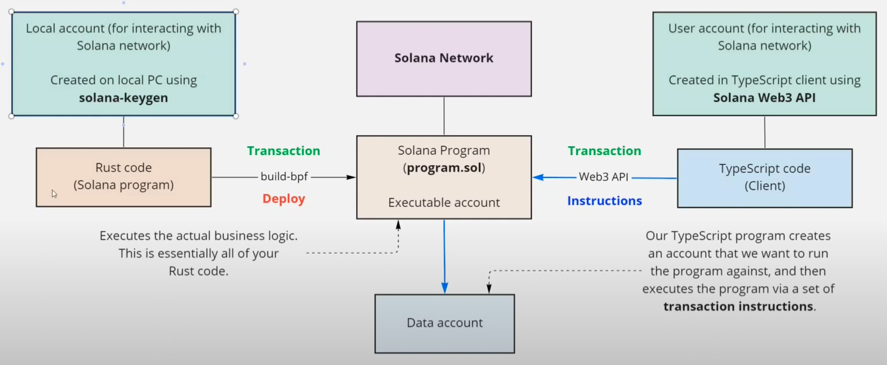

# solana-sumsquare

## persisting data

1. create executable program account
2. create seed data account with above owner where result from exe is stored
3. run the exe program

 

</a>

 

## usage

1. `npm run reset-and-build`

2. `solana logs | grep "{program_id} invoke" -A 10`

3. `npm run example:sum`
